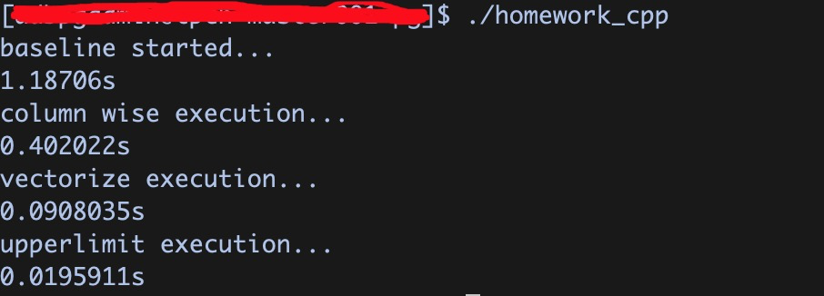

# 说明

## 代码分析

表达式计算，好在纯内存计算，无需考虑IO相关的性能问题。
但是目前的处理模式是经典的Volcano Model，将一个算子生成一个算子树，然后逐行处理。这样的计算模型会存在几个问题：

1. 在for循环计算中，会存在大量的虚函数调用、分支判断等，并递归调用栈过长，对CPU的Cache和不友好，影响代码的Locality，降低CPU的流水线执行效率；
2. 数据级别的开销，随着数据量的增加，性能劣化会更加严重。

针对这种表达式计算优化，已经有很多研究实现，主要集中两点：向量化执行和codegen，所以这里也集中进行这两个方向的优化。

## 向量化执行

主要集中下面两点优化：

1. 内存中数据由行存结构改为列存结构，内存中数据更加紧凑，提高内存效率；
2. 向量化执行，每个expr节点由单行执行改为批量执行，这里没有考虑分批，所有的数据一起执行。

下面是执行结果：

其中 **columne wise execution**是列存改造后的执行结果，**vectorize execution**在列存基础上进行了向量化改造的结果。向量化优化性能提升十几倍，当NUM更大时提升倍数更大。这里编译器的loop unrolling和SIMD应该也发挥了很大作用。

运行环境：centos7，128G内存，CPU：Intel(R) Xeon(R) Platinum 8269CY CPU @ 2.50GHz，32核。

**upperlimit**是这个表达式的性能极限，将整个expr表达式树压成一个算式的计算时间。

## codegen

通过codegen技术可以将表达式展开成一个算式，在向量化执行基础上，理论上可以达到上述**upperlimit**的性能。
codegen技术有多种实现方式，例如动态的生成源码然后编译链接到主程序和llvm jit。目前很多开源产品中大量使用例如：PostgreSQL、Impala、Spark等。

这里会尝试在向量化执行的基础上实现llvm codegen的优化，可能需要两周的空闲时间（llvm本身比较重），大概月底完成。

## References
https://www.postgresql.org/message-id/flat/20161206034955.bh33paeralxbtluv%40alap3.anarazel.de
https://databricks.com/blog/2016/05/23/apache-spark-as-a-compiler-joining-a-billion-rows-per-second-on-a-laptop.html
https://www.vldb.org/pvldb/vol4/p539-neumann.pdf?spm=ata.13261165.0.0.475167b0QoQE5p&file=p539-neumann.pdf
http://www.hyper-db.com/
https://dzone.com/articles/how-we-implement-10x-faster-expression-evaluation
https://www.cockroachlabs.com/blog/how-we-built-a-vectorized-sql-engine/#
